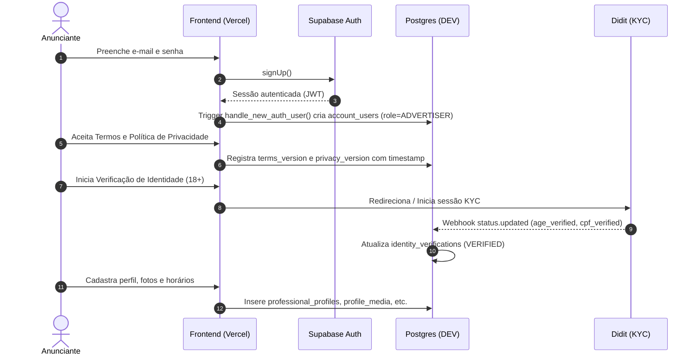
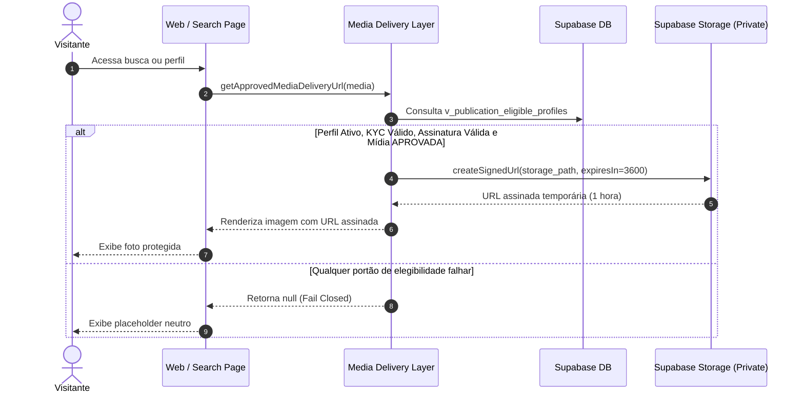
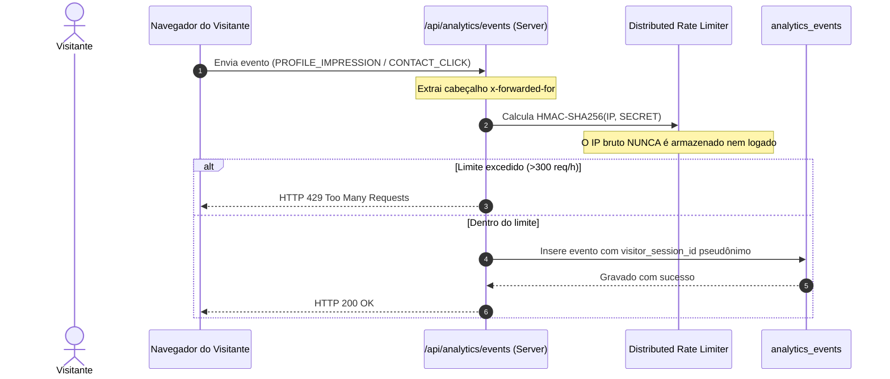
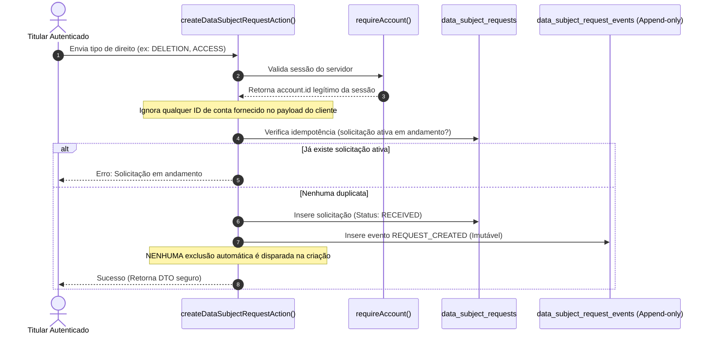

# Mapa de Fluxos de Dados e Processamento — Velvet

> **Fase:** LGPD-01 — Data Inventory & Data Subject Rights Foundation  
> **Status:** AUDITADO E CONSOLIDADO  

---

## 1. Fluxo de Cadastro e Onboarding do Anunciante

---

## 2. Fluxo de Entrega Segura de Mídia (Zero-Trust Signed URLs)

---

## 3. Fluxo de Telemetria e Métricas Sem Armazenamento de IP

---

## 4. Fluxo de Solicitação de Direitos do Titular (LGPD DSR)

