# Grafo de Relações e Dependências do Titular — Velvet

> **Fase:** LGPD-01 — Data Inventory & Data Subject Rights Foundation  
> **Status:** AUDITADO E CONSOLIDADO  

---

## 1. Topologia da Identidade do Titular

O Velvet estrutura a identidade dos titulares a partir de duas raízes canônicas complementares:
1. **`auth.users` (Supabase Auth)**: Raiz criptográfica de autenticação (e-mail, senha com hash, tokens de sessão).
2. **`public.account_users` (Velvet Domain)**: Raiz do domínio da aplicação (`id`, `role`, `status`, `onboarding_status`, consentimentos legais).

```mermaid
graph TD
  AuthUser["auth.users (Root)"] -->|"1:1 (CASCADE)"| AccountUser["public.account_users"]

  AccountUser -->|"1:1 (CASCADE)"| Profile["public.professional_profiles"]
  AccountUser -->|"1:N (CASCADE)"| KYC["public.identity_verifications"]
  AccountUser -->|"1:1 (CASCADE)"| ClientMem["public.client_memberships"]
  AccountUser -->|"1:N (CASCADE)"| Subs["public.subscriptions"]
  AccountUser -->|"1:N (CASCADE)"| BillingOverrides["public.billing_overrides"]
  AccountUser -->|"1:N (RESTRICT)"| DSR["public.data_subject_requests"]

  Profile -->|"1:N (CASCADE)"| Media["public.profile_media"]
  Profile -->|"1:N (CASCADE)"| Videos["public.profile_videos"]
  Profile -->|"1:N (CASCADE)"| Locations["public.professional_profile_locations"]
  Profile -->|"1:N (CASCADE)"| Offerings["public.professional_profile_offerings"]
  Profile -->|"1:N (CASCADE)"| Boosts["public.profile_boosts"]
  Profile -->|"1:1 (CASCADE)"| AvailSettings["public.professional_availability_settings"]
  Profile -->|"1:N (CASCADE)"| WeeklyAvail["public.professional_weekly_availability"]
  Profile -->|"1:N (CASCADE)"| AvailExceptions["public.professional_availability_exceptions"]
  Profile -->|"1:1 (CASCADE)"| ConciergeSettings["public.professional_concierge_settings"]
  Profile -->|"1:N (CASCADE)"| ConciergeFAQs["public.professional_concierge_faqs"]
  Profile -->|"1:N (CASCADE)"| StatusEvents["public.professional_profile_status_events"]

  Media -.->|"Orphan Risk / Manual Coordinated Delete"| StorageMedia["Bucket: profile-media"]
  Videos -.->|"Orphan Risk / Manual Coordinated Delete"| StorageVideos["Bucket: profile-videos"]

  AccountUser -->|"1:N (CASCADE / Anonymize)"| Reviews["public.professional_reviews"]
  Reviews -->|"1:1 (CASCADE)"| ReviewResponses["public.professional_review_responses"]
  Reviews -->|"1:N (CASCADE)"| ReviewReports["public.review_reports"]
```

---

## 2. Análise de Vínculos e Ações `ON DELETE`

### 2.1. Relações em `CASCADE` (Exclusão Automática no Banco)
* `account_users` -> `professional_profiles`
* `account_users` -> `identity_verifications`
* `account_users` -> `client_memberships`
* `account_users` -> `subscriptions`
* `professional_profiles` -> `profile_media` (Metadados apenas)
* `professional_profiles` -> `profile_videos` (Metadados apenas)
* `professional_profiles` -> `professional_profile_locations`
* `professional_profiles` -> `professional_profile_offerings`
* `professional_profiles` -> `professional_availability_*`
* `professional_profiles` -> `professional_concierge_*`
* `professional_profiles` -> `professional_profile_status_events`

### 2.2. Relações em `RESTRICT` (Bloqueio de Exclusão para Proteção Legal)
* **`public.data_subject_requests` (`requester_account_user_id`)**:  
  Possui constraint `ON DELETE RESTRICT`. Isso impede que a conta seja excluída silenciosamente no banco caso haja solicitações LGPD registradas, garantindo que a trilha de auditoria e a comprovação de atendimento legal permaneçam íntegras.

### 2.3. Relações em `SET NULL`
* **`public.billing_admin_audit_logs` (`target_account_user_id`)**:  
  Ao excluir a conta-alvo, a chave estrangeira é ajustada para `NULL`, preservando o registro de auditoria da ação administrativa realizada no sistema.

---

## 3. Riscos de Orfandade e Limpeza Manual Coordenada

### 3.1. Arquivos no Supabase Storage (`profile-media` e `profile-videos`) — **ALTO RISCO**
* **Problema:** As foreign keys do PostgreSQL **não operam sobre o Storage de objetos** do Supabase.
* **Impacto:** Se uma linha de `professional_profiles` for excluída no banco, as linhas filhas em `profile_media` e `profile_videos` sofrerão CASCADE no banco de dados, mas os arquivos físicos (`.webp`, `.mp4`, `.jpg`) permanecerão no Storage como **arquivos órfãos**.
* **Mitigação Obrigatória:** A exclusão de um perfil na Fase LGPD-02 deve orquestrar:
  1. Leitura de todos os `storage_path` e `poster_storage_path` antes do DELETE;
  2. Chamada atômica à API de Storage do Supabase (`admin.storage.from(...).remove(paths)`);
  3. Somente após a confirmação da remoção física dos arquivos, disparar o DELETE dos metadados relacionais.

### 3.2. Avaliações de Clientes (`professional_reviews`) — **RISCO MÉDIO**
* **Problema:** A constraint padrão em `reviewer_account_user_id` é `ON DELETE CASCADE`. Se um cliente que avaliou 10 profissionais solicitar a exclusão de sua conta, todas as suas avaliações seriam excluídas em cascata.
* **Impacto:** Isso alteraria retrospectivamente a média de avaliações dos profissionais e apagaria o histórico de reputação.
* **Mitigação Recomendada:** Na Fase LGPD-02, a rotina de exclusão de cliente deve **desvincular e anonimizar** a avaliação (substituir o comentário por texto neutro e desvincular o ID do autor), em vez de executar o CASCADE bruto.
